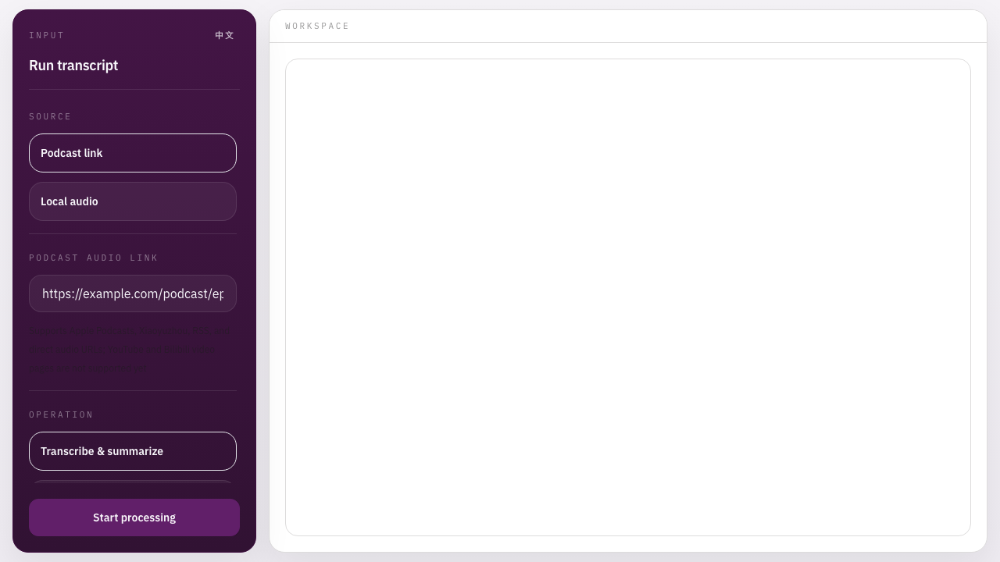

# Podcast Summer

Web-first podcast transcription and summarization.

**English | [中文](README_zh.md)**



## Overview

Podcast Summer turns podcast links or uploaded audio files into a transcript, a summary, and an optional translation.

The main path is the web app. Electron still exists as a legacy wrapper, but it is not the actively maintained surface.

## Quick Start

```bash
git clone https://github.com/blue1y2s/podcast-summer.git
cd podcast-summer
npm install
cp .env.example .env
# set GEMINI_API_KEY in .env
npm start
```

Open the URL printed by the server, usually `http://localhost:3000`.

If you want the shortest path to a working setup, start with `gemini_audio`.

## Processing Flow

1. Provide a podcast link or upload a local audio file.
2. The server resolves or receives the audio source.
3. The selected ASR backend generates the raw transcript.
4. The transcript pipeline refines formatting, speaker turns, summary, and optional translation.
5. Output files are written to `results/transcriptions`, and local history snapshots are stored under `server/temp`.

The full request and backend pipeline is documented in [docs/backend-pipeline.md](docs/backend-pipeline.md).

## ASR Backend Overview

Supported ASR backends:

- `auto`: tries available backends in a fixed fallback order.
- `fun_asr_file_diarization`: DashScope file transcription with native speaker diarization for public direct audio URLs.
- `qwen3_asr`: DashScope Qwen3-ASR with VAD-based chunking for long audio.
- `gemini_audio`: Gemini audio transcription with the lightest setup.
- `fun_asr_realtime`: DashScope Fun-ASR realtime recognition for uploaded or downloaded audio.
- `whisperx_local`: local WhisperX + pyannote with real speaker diarization.
- `whisper_local`: local faster-whisper as the simplest offline-style fallback.

Current `auto` order:

```text
fun_asr_file_diarization -> qwen3_asr -> gemini_audio -> fun_asr_realtime -> whisperx_local -> whisper_local
```

Python is only required for these backends:

- `whisper_local`
- `whisperx_local`
- `qwen3_asr`
- `fun_asr_realtime`
- `fun_asr_file_diarization`

For backend-by-backend constraints and tradeoffs, see [docs/backend-pipeline.md](docs/backend-pipeline.md).

## Output And History

- Exported text artifacts: `results/transcriptions`
- Latest result snapshot: `server/temp/latest-result.json`
- Local history snapshots: `server/temp/history`

The current implementation also exposes history APIs for reopening and deleting saved runs.

## Detailed Docs

- [Backend pipeline details](docs/backend-pipeline.md)
- [中文详细说明](docs/backend-pipeline.zh.md)

## Commands

```bash
npm start
npm run dev
npm run ui:dev
npm run ui:build
npm run ui:preview
npm test
npm run check
```

`npm test` runs a no-secrets smoke check against the running Express app. `npm run check` rebuilds the UI and then runs the smoke check.

`npm run desktop` still exists, but it is legacy packaging.

## Attribution

This repository started from [wendy7756/podcast-transcriber](https://github.com/wendy7756/podcast-transcriber) and has since been reshaped around a web-first workflow.

## License

Apache 2.0. See [LICENSE](LICENSE).
