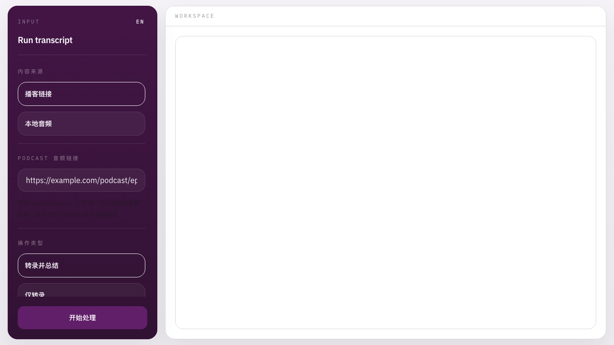

# Podcast Summer

以 Web 为主的播客转录与总结工具。

**中文 | [English](README.md)**



## 简介

Podcast Summer 是一个 Web 应用，用来把播客链接或本地音频处理成 transcript、summary，以及按需生成的 translation。

当前主路径只有 Web。Electron 只是遗留壳层，不属于主动维护范围。

## 快速开始

```bash
git clone https://github.com/blue1y2s/podcast-summer.git
cd podcast-summer
npm install
cp .env.example .env
# 在 .env 里填写 GEMINI_API_KEY
npm start
```

访问 `http://localhost:3000`。

如果你想用最短路径先跑起来，直接从 `gemini_audio` 开始。

## 什么时候需要 Python

只有在你要使用下面这些后端时，才需要 Python：

- `whisper_local`
- `whisperx_local`
- `qwen3_asr`
- `fun_asr_realtime`
- `fun_asr_file_diarization`

最小准备方式：

```bash
python3 -m venv venv
source venv/bin/activate
pip install --upgrade pip
```

按需安装：

```bash
pip install faster-whisper
pip install whisperx pyannote.audio
pip install dashscope silero-vad qwen3-asr-toolkit
```

如果要做本地转录或转码，请确认系统里有 `ffmpeg`。

## 后端

支持的 ASR backend：

- `auto`
- `gemini_audio`
- `qwen3_asr`
- `fun_asr_realtime`
- `fun_asr_file_diarization`
- `whisper_local`
- `whisperx_local`

当前 `auto` 顺序：

```text
fun_asr_file_diarization -> qwen3_asr -> gemini_audio -> fun_asr_realtime -> whisperx_local -> whisper_local
```

补充：

- `fun_asr_file_diarization` 只能处理公网直链
- `whisperx_local` 需要 `PYANNOTE_TOKEN`

## 常用命令

```bash
npm start
npm run dev
npm run ui:dev
npm run ui:build
npm run ui:preview
```

`npm run desktop` 还在，但现在只是遗留包装层。

## 输出

- 导出文件：`results/transcriptions`
- 本地历史：`server/temp`

## 致谢

这个仓库最初来自 [wendy7756/podcast-transcriber](https://github.com/wendy7756/podcast-transcriber)，现在已经按 Web-first 的方向继续整理和开发。

## 许可证

Apache 2.0，见 [LICENSE](LICENSE)。
